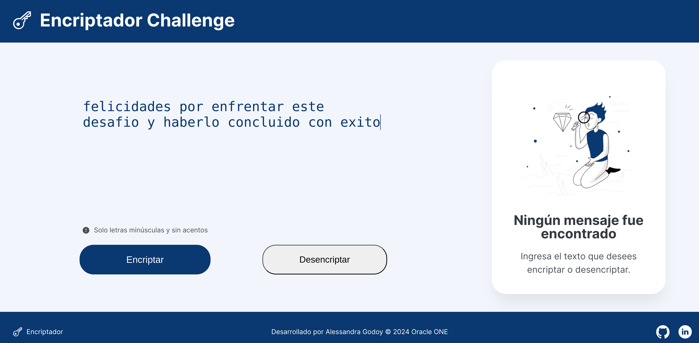
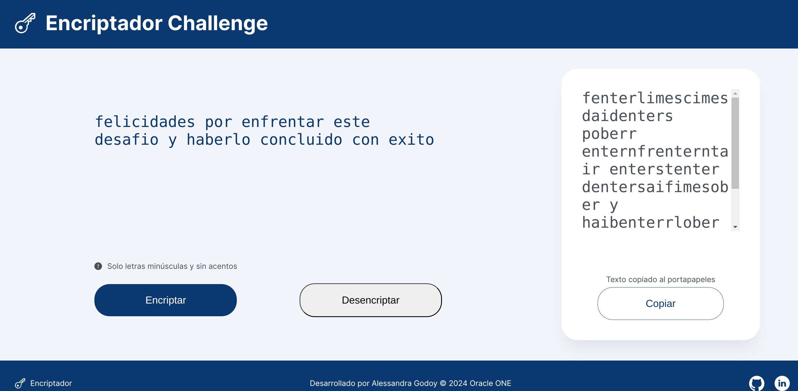

# Encriptador Challenge

## Descripción
Encriptador Challenge es una aplicación diseñada para encriptar textos, permitiendo el intercambio de mensajes secretos con otras personas que conozcan el secreto de la encriptación utilizada.

## Llaves de encriptación
Las siguientes son las reglas de encriptación utilizadas:
- La letra "e" se convierte en "enter"
- La letra "i" se convierte en "imes"
- La letra "a" se convierte en "ai"
- La letra "o" se convierte en "ober"
- La letra "u" se convierte en "ufat"

```
"gato" se convierte en "gaitober"
"gaitober" se convierte en "gato"
```

## Requisitos
- La aplicación debe funcionar solo con letras minúsculas.
- No deben ser utilizadas letras con acentos ni caracteres especiales.
- Debe ser posible convertir una palabra a su versión encriptada y también devolver una palabra encriptada a su versión original.

## Funcionalidades
- La página debe un campo para la inserción del texto que será encriptado o desencriptado, y el usuario debe poder escoger entre las dos opciones.
- El resultado debe ser mostrado en la pantalla.
- Un botón que copie el texto encriptado/desencriptado a la sección de transferencia, con la misma funcionalidad de "ctrl+C" o de la opción "copiar" del menú de las aplicaciones.

## Uso
1. Inserta el texto que deseas encriptar o desencriptar en el campo correspondiente.


2. Selecciona la opción de encriptar o desencriptar.
3. Visualiza el resultado en la pantalla.
4. Utiliza el botón de copiar para transferir el texto resultante a tu portapapeles.

